<div align="center">
  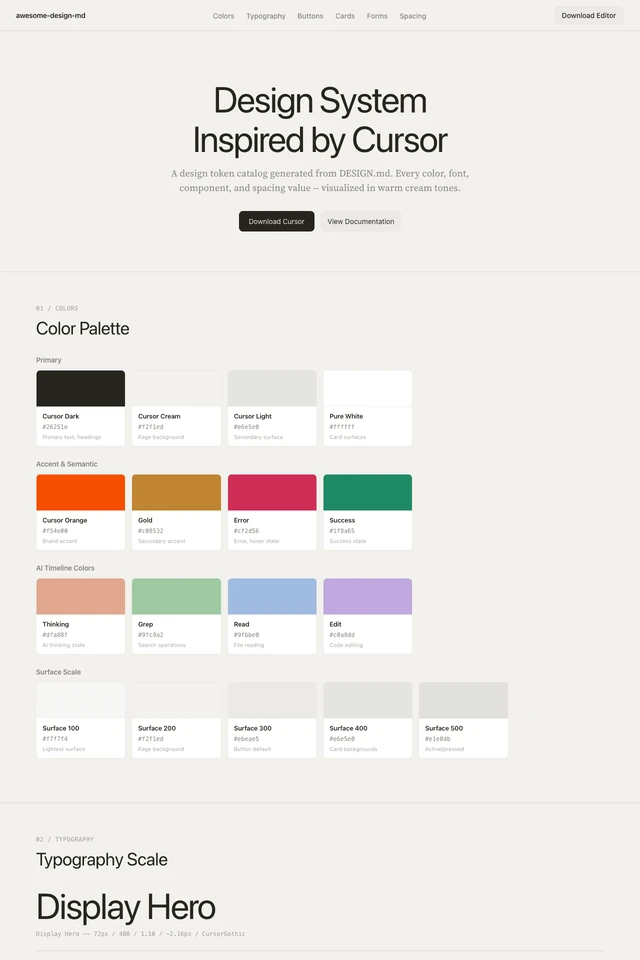
  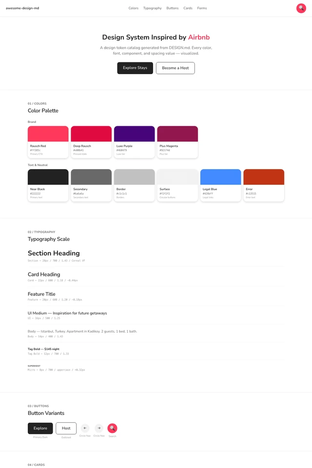
  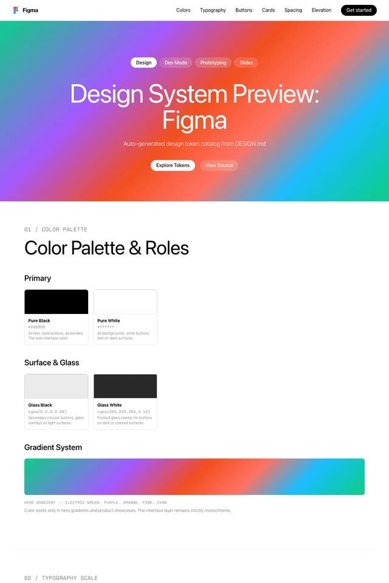
</div>

<br/>

<div align="center">
  <h1>Awesome DESIGN.md Preview</h1>
  <p>Visual gallery for <a href="https://github.com/VoltAgent/awesome-design-md">awesome-design-md</a> — browse, search, and download DESIGN.md files from 58 real products.</p>
</div>

<div align="center">

[](https://vuejs.org)
[](https://vitejs.dev)
[](https://typescriptlang.org)

</div>

---

## What is this?

[awesome-design-md](https://github.com/VoltAgent/awesome-design-md) collects DESIGN.md files from 58 popular products — but reading a list of links isn't the best way to find what you're looking for. This preview site gives each design system a proper home:

- **Card gallery** with light/dark thumbnails generated from the actual preview pages
- **Search & filter** by name, description, or category
- **Detail page** per theme — README rendered, with live light/dark screenshot toggle
- **DESIGN.md viewer** — full rendered markdown, download as `{theme}-DESIGN.md`
- **Dark mode** — full site, persistent across sessions

---

## Gallery

<div align="center">
<table>
<tr>
  <td align="center">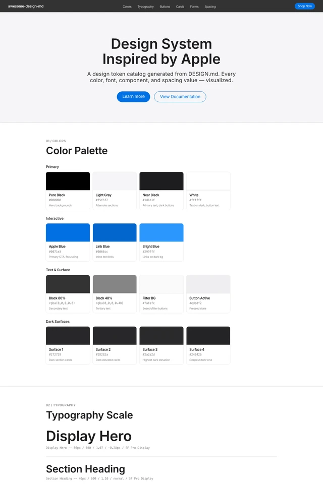<br/><sub>Apple</sub></td>
  <td align="center">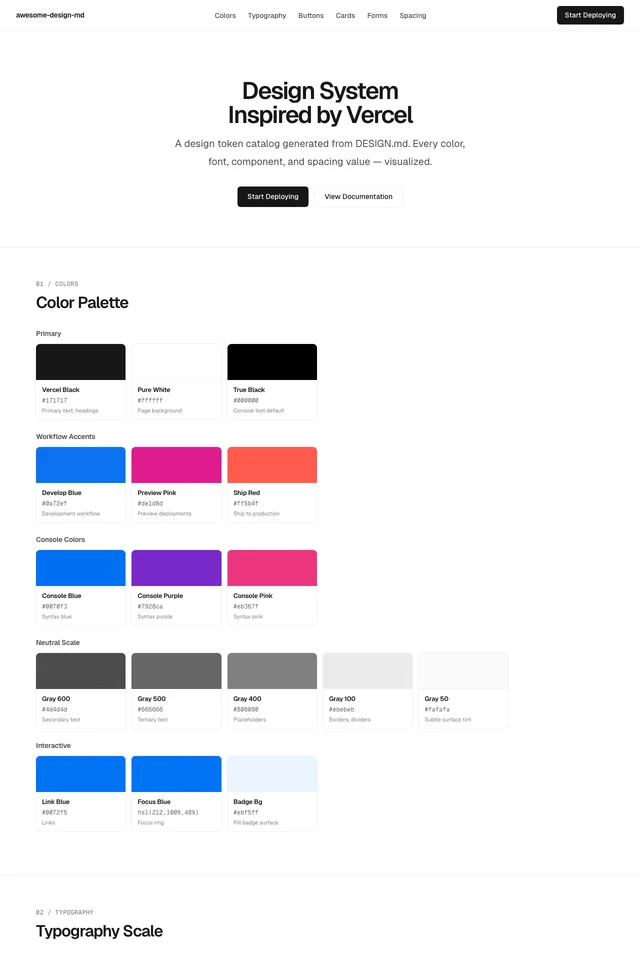<br/><sub>Vercel</sub></td>
  <td align="center">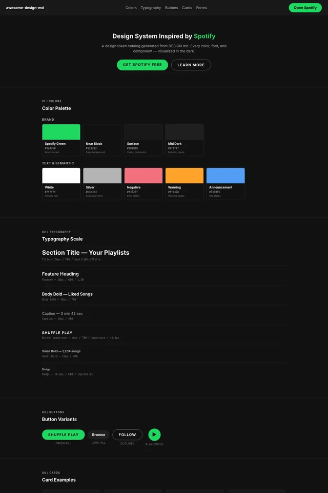<br/><sub>Spotify</sub></td>
  <td align="center">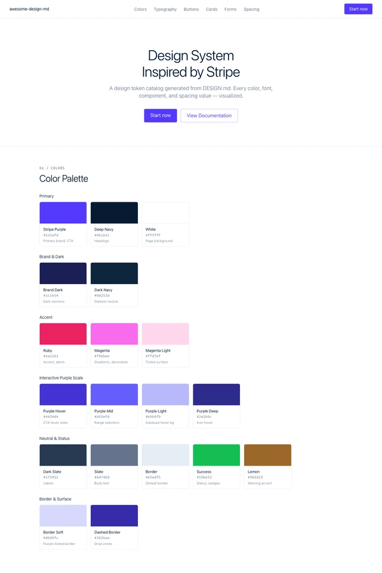<br/><sub>Stripe</sub></td>
</tr>
<tr>
  <td align="center">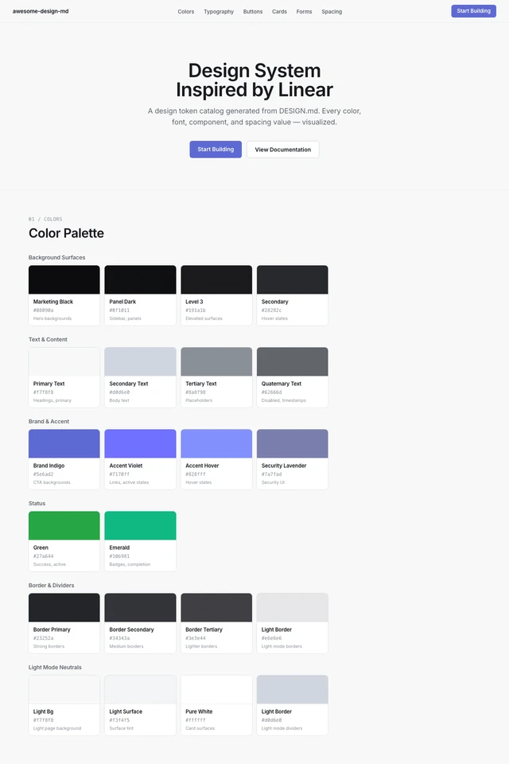<br/><sub>Linear</sub></td>
  <td align="center">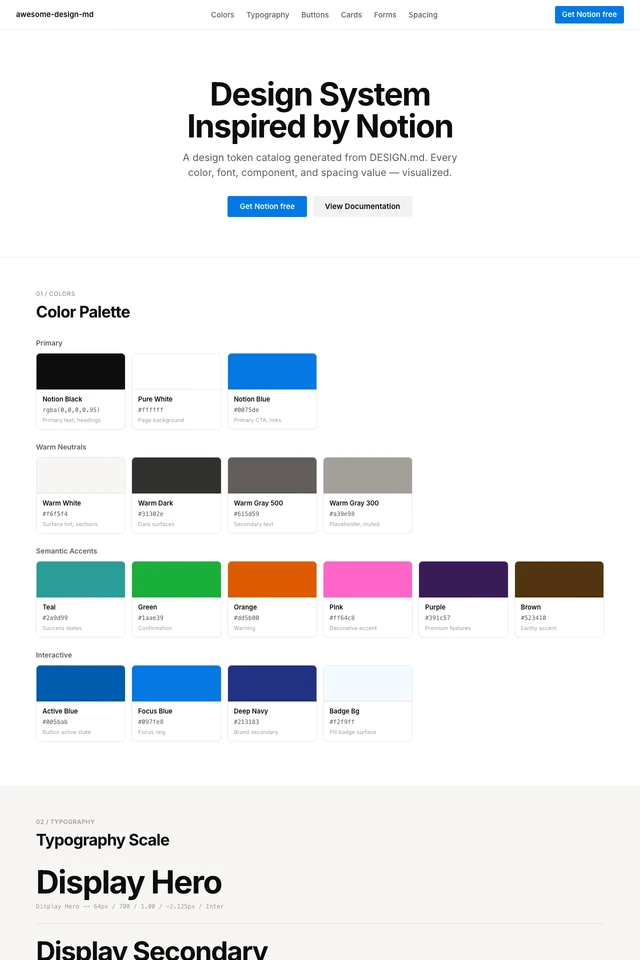<br/><sub>Notion</sub></td>
  <td align="center">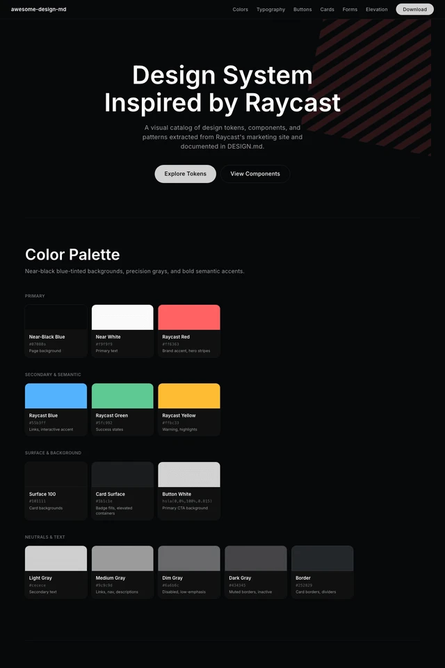<br/><sub>Raycast</sub></td>
  <td align="center">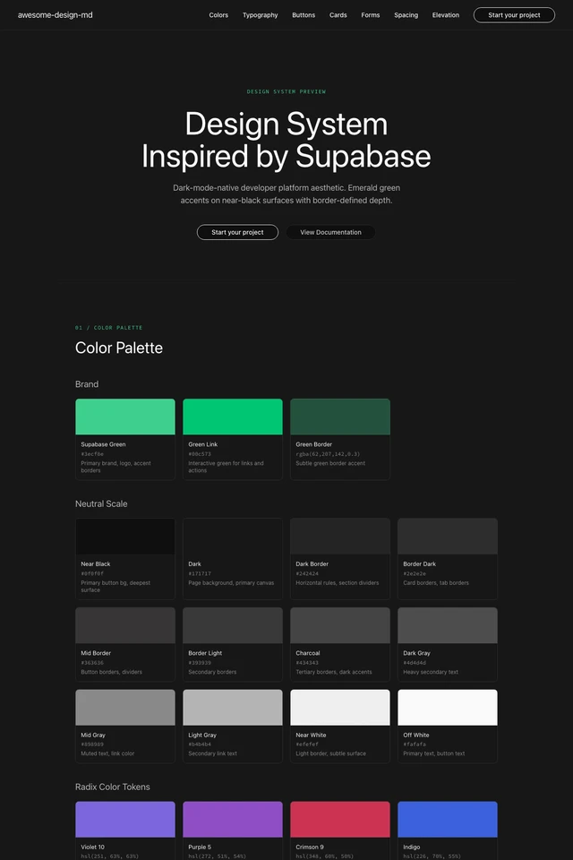<br/><sub>Supabase</sub></td>
</tr>
</table>
</div>

---

## Getting Started

```bash
# Clone the preview project
git clone https://github.com/ropean/awesome-design-md-preview
cd awesome-design-md-preview

# Install dependencies
pnpm install

# Start dev server
pnpm dev
```

### Generate thumbnails

Thumbnails are committed to the repo and don't need to be regenerated. If you want to refresh them:

```bash
pnpm thumbnails           # skip existing
pnpm thumbnails -- --force  # regenerate all
```

### Build

```bash
pnpm build      # output → dist/
pnpm preview    # preview the build locally
```

---

## Tech Stack

| Layer | Technology |
|---|---|
| Framework | Vue 3 + Composition API |
| Build | Vite 5 |
| Language | TypeScript |
| Search | Fuse.js (client-side fuzzy) |
| Markdown | markdown-it |
| Fonts | Space Grotesk · Lora · JetBrains Mono |
| Images | sharp (thumbnail generation) |
| Deploy | Cloudflare Pages |

Static theme detail pages and DESIGN.md pages are generated at build time by custom Vite plugins — no SSR, no router needed for those routes.

---

## Design Tokens

The site uses a single CSS token system based on the [Cursor DESIGN.md](https://github.com/VoltAgent/awesome-design-md/tree/main/design-md/cursor) color palette:

```css
--color-accent:  #f54e00;   /* terracotta orange */
--color-bg:      #f2f1ed;   /* warm off-white    */
--color-text:    #26251e;   /* near-black        */

--space-1: 8px;   --space-2: 16px;
--space-3: 24px;  --space-4: 32px;

--radius-sm: 4px;  --radius-md: 8px;  --radius-pill: 9999px;
```

---

## Credits

- Design systems sourced from [awesome-design-md](https://github.com/VoltAgent/awesome-design-md) by VoltAgent
- Icons from [Lucide](https://lucide.dev) (SVG sprite)
- Thumbnails generated from R2-hosted preview pages

---

## License

MIT
